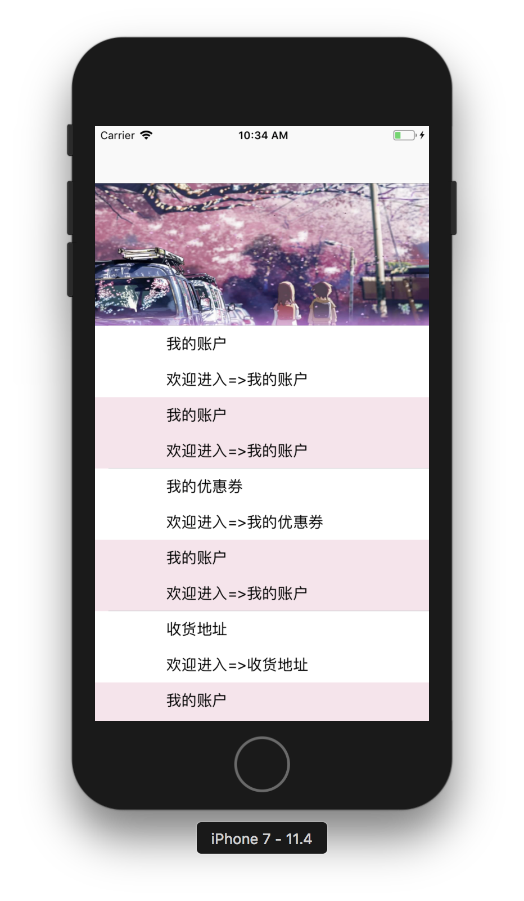
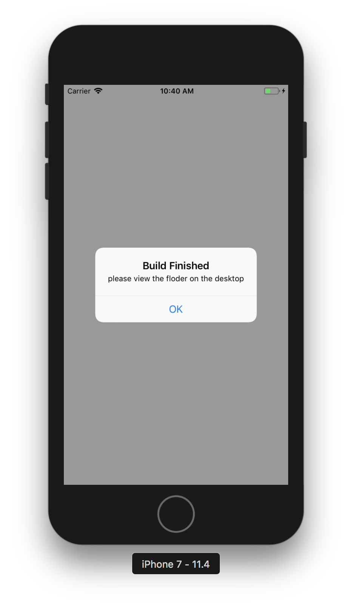

## Inject inspirational into the project

### SQPerformance
> Focus on performance optimization topics, Include `fluency-ui` technology

##### Get Started

- First, you need a [node](https://nodejs.org/en/) server environment

- Then, run the following command to launch server

```
$ node server.js
```

##### Contents
- `Pre-layout` >>> when the `asynchronous thread` is started, the `typesetting processing` is performed while the network data is acquired.
- `Reuse-pool` >>> design a universal `reuse pool` to reduce `memory consumption`. reference `UITableViewCell`.
- `Pre-decode` >>> perform image `decoding operations` on `asynchronous threads` to `reduce resource usage` of the main thread
- `Pre-render` >>> `graphics rendering` in `asynchronous threads`, using the `CPU` for rendering operations, avoiding `GPU` `off-screen rendering` consumption
- `Asynchronous drawing` >>> create a `graphics context` in an `asynchronous thread` and draw it into `layer.contents`


##### Display


- `step1`: The left side is used `pre-layout`, `reusepool`, `pre-decode`, `pre-render`.
- `step2`: The right side is used `pre-layout`, `reusepool`, `pre-decode`, `pre-render`, `asynchronous drawing`.

Then you can see that is maintained at 60fps when launch the `asynchronous drawing`.


##### Article
- [iOS 界面性能优化浅析 / 2018 / 07](https://coderzsq.github.io/2018/07/iOS-%E7%95%8C%E9%9D%A2%E6%80%A7%E8%83%BD%E4%BC%98%E5%8C%96%E6%B5%85%E6%9E%90/)

<br/>

### SQTemplate

> Focus on generating template architecture files to speed up productivity & `code specification`

##### Get Started

- This project is base on the `RouterPattern` practice, So you need to clone [RouterPattern](https://github.com/coderZsq/coderZsq.practice.native/tree/master/RouterPattern) 
- Then, you need a [node](https://nodejs.org/en/) server environment
- Last, run the following command to launch server

```
$ cd RouterPattern/server/RouterPattern
$ npm start
```

##### Content
- `SQTemplate`  
	- `Template` >>> a template for `general architecture design` 
	- `UITemplate`>>> `quickly` create a `template for the UI`
- `SQBuilder`	
	- `SQBuilder`	 >>> generate `iOS` / `Android` architecture code from a template
	- `SQBuilder Sample` >>> a `simple version` generator written in `python`
	
##### Display



- `img1`: `SQTemplate` project reference `MVC`, `MVVM`, `MVP`, `VIPER`, `CDD` design.
- `img2`: `SQBuilder` project generator code on the desktop.

##### Article

- [iOS 执行.py脚本生成解耦架构 / 2017 / 05](https://coderzsq.github.io/2017/05/iOS-%E6%89%A7%E8%A1%8C.py%E8%84%9A%E6%9C%AC%E7%94%9F%E6%88%90%E8%A7%A3%E8%80%A6%E6%9E%B6%E6%9E%84/)
- [iOS 执行.py脚本生成UI层结构 / 2017 / 05](https://coderzsq.github.io/2017/05/iOS-%E6%89%A7%E8%A1%8C.py%E8%84%9A%E6%9C%AC%E7%94%9F%E6%88%90UI%E5%B1%82%E7%BB%93%E6%9E%84/)
- [iOS 移动端面向文档开发 / 2017 / 07](https://coderzsq.github.io/2017/07/iOS-%E7%A7%BB%E5%8A%A8%E7%AB%AF%E9%9D%A2%E5%90%91%E6%96%87%E6%A1%A3%E5%BC%80%E5%8F%91/)
- [iOS 移动端生成工具开发 / 2017 / 08](https://coderzsq.github.io/2017/08/iOS-%E7%A7%BB%E5%8A%A8%E7%AB%AF%E7%94%9F%E6%88%90%E5%B7%A5%E5%85%B7%E5%BC%80%E5%8F%91/)
- [iOS 移动端架构初探心得 / 2017 / 11](https://coderzsq.github.io/2017/11/iOS-%E7%A7%BB%E5%8A%A8%E7%AB%AF%E6%9E%B6%E6%9E%84%E5%88%9D%E6%8E%A2%E5%BF%83%E5%BE%97/)

<br/>

### SQLifestyle
> Focus on `quickly build projects` and integrate some fun `animations`

##### Contents

- `SQExtension` >>> quickly build project infrastructure and `tools`.
- `Infinite carousel` >>> the `easiest way` to achieve high performance infinite carousel.
- `Custom transition` >>> achieve a full range of `custom transition mechanisms`.
- `Gradient navigationbar`>>> analyze the implementation process and principle of the `gradient navigation bar` in all aspects


##### Display


##### Article

- [iOS 做好开工前的准备 / 2016 / 05](https://coderzsq.github.io/2016/05/iOS-%E5%81%9A%E5%A5%BD%E5%BC%80%E5%B7%A5%E5%89%8D%E7%9A%84%E5%87%86%E5%A4%87/)
- [iOS 集成Reveal UI调试利器 / 2016 / 05](https://coderzsq.github.io/2016/05/iOS-%E9%9B%86%E6%88%90Reveal-UI%E8%B0%83%E8%AF%95%E5%88%A9%E5%99%A8/)
- [iOS 投机流实现 无限轮播图 / 2016 / 06](https://coderzsq.github.io/2016/06/iOS-%E6%8A%95%E6%9C%BA%E6%B5%81%E5%AE%9E%E7%8E%B0-%E6%97%A0%E9%99%90%E8%BD%AE%E6%92%AD%E5%9B%BE/)
- [iOS 会跳舞的TabbarController / 2016 06](https://coderzsq.github.io/2016/06/iOS-%E4%BC%9A%E8%B7%B3%E8%88%9E%E7%9A%84TabbarController/)
- [iOS 超Easy实现 渐变导航栏 / 2016 / 06](https://coderzsq.github.io/2016/06/iOS-%E8%B6%85Easy%E5%AE%9E%E7%8E%B0-%E6%B8%90%E5%8F%98%E5%AF%BC%E8%88%AA%E6%A0%8F/)
- [iOS 狂霸酷炫拽之Button动效 / 2016 / 07](https://coderzsq.github.io/2016/07/iOS-%E7%8B%82%E9%9C%B8%E9%85%B7%E7%82%AB%E6%8B%BD%E4%B9%8BButton%E5%8A%A8%E6%95%88/)
-  [iOS 5行代码搞定全屏Pop转场 / 2016 / 07](https://coderzsq.github.io/2016/07/iOS-5%E8%A1%8C%E4%BB%A3%E7%A0%81%E6%90%9E%E5%AE%9A%E5%85%A8%E5%B1%8FPop%E8%BD%AC%E5%9C%BA/)


